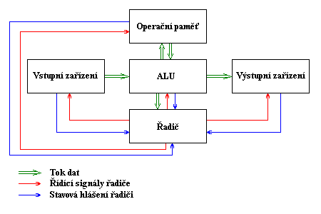
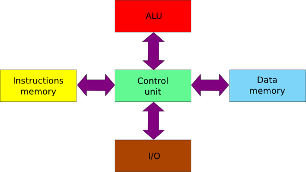

# Historie výpočetní techniky
První číslicové počítače byly sestaveny ve 30. letech 20. Století, avšak za vynálezce počítačů je považován Charles Babbage který vymyslel základní principy fungování stroje pro řešení složitých výpočtů. Mezi předchůdce počítačů patří například Logaritmické tabulky, ty umožňují násobení a dělení pomocí logaritmů. Po nich následovalo logaritmické pravítko, kde byla reálná čísla reprezentována vzdáleností na ose. Přímý předchůdcem dnešních počítačů jsou jednoúčelové stroje které využívaly děrné štítky (médium pro záznám a pozdější zpracování dat). Ty byly vytlačeny na konci 20. století modernějšími médii jako je disketa nebo CD.

## Definice počítače
- Stroj pro zpracovávání informací podle předem daného programu.

## Rozdělení podle typu signálu s kterým počítače pracují
- Analogové
- Číslicové (digitální)
- Hybridní

## Rozdělení dle architektury
### 1. Architektura von Neuman
- Toto schéma používá jednu sběrnici, na kterou jsou připojeny všechny aktivní prvky. Struktura počítače je nezávisla na typu řešení úlohy a je řízená obsahem paměti. Z této architektury se více méně vychází dodnes. Zasadní rozdíl je že dnešní počítače používají multitasking.
- Počítač se skládá z pěti hlavních modulů:
- Operační paměť (memory): uchování zpracovávaného programu, zpracovávaných dat a výsledků výpočtu
- ALU - Arithmetic-Logic Unit (aritmetickologická jednotka): jednotka provádějící veškeré aritmetické výpočty a logické operace. Obsahuje sčítačky, násobičky (pro aritmetické výpočty) a komparátory (pro porovnávání)
- Řadič (control unit): řídící jednotka, která řídí činnost všech částí počítače. Toto řízení je prováděno pomocí řídících signálů, které jsou zasílány jednotlivým modulům. Reakce na řídící signály, stavy jednotlivých modulů jsou naopak zasílány zpět řadiči pomocí stavových hlášení
- Vstupní zařízení (input): zařízení určená pro vstup programu a dat.
- Výstupní zařízení (output): zařízení určená pro výstup výsledků, které program zpracoval
- 
</img>

#### Nevýhody
- Společné uložení dat a kodu může mít při chybě za následek přepsání vlastního programu.
Charakteristické je použití elektronek a relé. Počítače vyrobené touto architekturou: EDVAC

### 2. Harwardská architektura
- Harvardská architektura má na rozdíl od von Neumanovy architektury oddělený pamětový prostor pro data a pro program. Také dovoluje pro pamět programu používat například paměť ROM a umožňuje v podstatě zdvojnásobit velikost paměti.

</img>

#### Výhody
- Oddělení paměti dat a progamu přináší výhody:
- Program nemůže přepsat sám sebe,
- Paměti mohou být vyrobeny odlišnými technologiemi, 
- Každá paměť může mít jinou velikost nejmenší adresovací jednotky, · dvě sběrnice umožňují jednoduchý paralelizmus, kdy lze přistupovat pro instrukce i data současně. 

#### Nevýhody
- dvě sběrnice kladou vyšší nároky na vývoj řídící jednotky procesoru a zvyšují i náklady na výrobu výsledného počítače, 
- nevyužitou část paměti dat nelze použít pro program a obráceně.
Výroba pomocí relé a elektronek. Počítače vyrobené touto architekturou: MARK1

## Generace počítačů

| Generace | Období (léta) | Základní součástky                               | Programování                        | Op/sec                            | Paměť    |
| :-: | :----------- | :----------------------------------------------------- | :---------------------------------- | :-------------------------------- | :------- |
| 0 | 30.–⁠40.        | Elektromagnetická relé                                 | Strojový kód                        | 10                                | 100&nbsp;B    |
| 1  | 40.–⁠50.       | Elektronky                                             | Strojový kód, asembler              | 102–⁠104     | 1–⁠2&nbsp;KB   |
| 2 | 50.–⁠60.        | Tranzistory                                            | Vyšší jazyky FORTRAN, ALGOL, COBOL  | 104–⁠105    | 16–⁠32&nbsp;KB |
| 3 | 60.–⁠70.        | Integrované obvody SSI (Small Scale Integration)       | OS, moderní jazyky                  | 105–⁠5&nbsp;*&nbsp;106 | 0,5–⁠2&nbsp;MB |
| 3,5 |              | Integrované obvody MSI nebo LSI (Middle nebo Large Scale Integration) | Rozšiřitelné OS a modernější jazyky | 106     | 1–⁠16&nbsp;MB  |
| 4 | 70.–⁠současnost | Integrované obvody VLSI (Very Large Scale Integration) | OS a jazyky přizpůsobené uživatelům | 106–⁠3&nbsp;*&nbsp;107 | 1–⁠18&nbsp;MB  |

### 0. Generace (1930)
- **Elektromagnetická relé, reléové obvody, magnetické bubnové operační paměti**
- Několik operací za sekundu
- Děrnoštítkové a děrnopáskové jednotky, elektrické psací stroje nebo dálnopisy
- Vědeckotechnické výpočty
- Vědecká nebo univerzitní pracoviště

#### Počítače
- 1938, **Z1** (Konrad Zuse) první elektromechanický programovatelný počítač s kolíčkovou pamětí na 16 čísel (1939 verze Z2)
- 1940, **Complex Number Calculator** (Samuel Williamsa George Stibitz, Bells Lab.) kalkulátor užívající telefonní přepínače
- 1941, **V3** (později Z3, Konrad Zuse) digitální programový automat považovaný za první bezchybně fungující programovatelný kalkulátor
- 1942, **ABC** (Atanasoff-Berry Computer, John Atanasoff a Clifford Berry)digitální počítač na řešení lineárních rovnic
- 1943, **Colossus Mark I a II** anglická výzvědná služby v Bletchley Park, počítač (1500 elektronek resp. 1944 2400 elektronek) užíván při dekódování německých vojenských zpráv (šifrovány strojem Enigma)
- 1944, **ASCC** (Automatic Sequence ControlledCalculator Mark I, Howard H. Aiken, Harvardská univerzita a IBM)programovatelný elektromechanický počítač,délka 16 m, váha 5 tun, 750 tis. součástek,5 elektromotorů a přes 800 km drátových spojů

### 1. Generace (1944)
- **Elektronky, elektronkové klopné obvody, elektronkové, později také feritové paměti**
- Von Neumannova architektura
- Diskrétní režim
- Strojový kód, jednoduché strojově závislé jazyky
- Několik set až několik tisíc operací za sekundu
- Děrnoštítkové a děrnopáskové jednotky, elektrické  psací stroje a řádkové tiskárny
- Magnetické páskové a bubnové paměti
- Vědeckotechnické výpočty, hromadné zpracování dat
- Omezená životnost elektronek – poruchovost

#### Počítače
- 1944 (46), **ENIAC** (Electronic Numerical Integrator And Computer, Pensylvánská státní univerzita)
	- První univerzální elektronkový počítač, cca 18 000 elektronek, 70 000 odporů, 1300 relé, spotřeba 150 kW, 5000 operací za sekundu, plocha tenisového hřiště, váha 30 tun, dva letecké motory na chlazenídělostřelecké palebné tabulky, vývoj atomové bomby
- 1945, **MANIAC** (Mathematical Analyser NumericalIntegrator And Computer, John von Neumann)
	- Vývoj vodíkové bomby
- 1947, **Harward Mark II** (Howard H. Aiken)
	- Ještě elektromechanická relé
- 1948, **IBM 604**
	- Elektronkový kalkulátor, program je uložen na výměnné desce
- 1949, **EDSAC** (Electronic Delayed Storage AutomaticComputer, Maurice V. Wilkes, univerzita v Cambridge)
	- První programovatelný elektronkový počítač
- 1951, **EDVAC** (Electronic Discrete Variable AutomaticComputer, John Mauchly, Presper Eckert)

##### Komerční počítače
- 1951, **UNIVAC I** (Universal Automatic Computer, Presper Eckert a John Mauchly)
	- První komerčně nabízený počítač v USA, 13 tun, 1905 operací za sekundu, 5200 elektronek, 125 kW
- 1952, **IBM 701** – Defense Calculator
	- Vědecké výpočty, 17 000 operací za sekundu
- 1953, **IBM 650** 
	- Univerzální sálový počítač s operační pamětí na rotujícím magnetickém bubnu
- 1954, **UNIVAC 1103, 1103A** (Remington Rand)
	- Počítače s feritovou pamětí

##### Československo
- 1957, **SAPO**
	- Samočinný počítač 
	- První počítač 1. generace, magnetická bubnová paměť, 7000 relé, 400 elektronek
- 1963, **EPOS 1**
	- První plně elektronkový počítač

### 2. Generace (1955)
- Polovodiče, tranzistory, tranzistorové klopné obvody, feritová paměť
- Dávkové zpracování
- Vyšší programovací jazyky FORTRAN, ALGOL, COBOL (1960)
- Vnější paměti a periferie s vlastní řídící jednotkou
- Stovky tisíc operací za sekundu
- Hromadné zpracování dat, vědeckotechnické výpočty, řízení technologických procesů
- Systémy pro dálkový přenos dat a terminály
- Strojové čtení písma, hlasové vstupy a výstupy

#### Počítače
- 1955, **TRADIC** (Transistor Digital Computer, J. H. Felker, Bellovy laboratoře)
	- První samočinný počítač na světě osazený tranzistory
- 1957, **ETL Mark II** (Japonsko)
	- Plně tranzistorový počítač, 130 tranzistorů, 1800 diod
- 1959, **NEAC 2201** (NEC Corporation)
	- První japonský komerční tranzistorový počítač představen v Paříži
- 1959, **IBM 1401**
	- První počítačový systém, kterého se prodalo přes 10 000 kusů
- 1960, **PDP-1** (DEC = Digital Equipment Corporation)
	- První komerční počítač s monitorem a klávesnicí
- 1964, Douglas Engelbart
	- **První počítačová myš**

##### Československo
- 1964, **MSP 2**
	- Malý stolní počítač 2
- 1965, **EPOS 2**
	- Sériově vyráběný pod názvem ZPA 600

### 3. Generace (1965)
- **Integrované obvodymalé integrace**
- Feritové a polovodičové paměti
- Multiprogramování, víceuživatelské systémy, operační systémy a knihovny uživatelských programů
- Vstup a výstup dat přes tzv. spool
- Znakem generace je i vazba hardware a software
- Stovky tisíc až miliony operací za sekundu
- Vzájemná kompatibilita, stavebnicové řešení
- Diskové a magnetopáskové paměti připojené kanály
- Mnoho různých programovacích jazyků

#### Počítače
- 1965, **PDP-8** (DEC)
	- První minipočítač s modulovým uspořádáním tranzistorových obvodů
- 1965, **IBM System/360**
	- Pracoval jak s pevnou, tak i s proměnnou délkou operandů (dat). Otevření cesty ke konstrukcím PC. V Československu jako JSEP-R1
- 1966, **HP 2115** (Hewlett Packard)
	- Malý kancelářský počítač vybavený několika programovacími jazyky (BASIC, ALGOL, FORTRAN) s výpočetním výkonem velkých sálových počítačů
- 1966, **Cal Tech** (Texas Instruments)
	- První kapesní elektronický kalkulátor
- 1971, **Intel 4004** (Intel Corporation)
	- První 4bitový mikroprocesor pro kalkulátor, 2300 tranzistorů, 60 000 operací za sekundu

##### Kapesní kalkulátory
- 1971, **Bowmar 901B** (Bowmar/Ali, Inc.)
	- První skutečně "kapesní" elektronický kalkulátor, 4 matematické funkce, červený LED displej
- 1972, **HP-35** (Hewlett Packard)
	- První elektronický vědecký kapesní kalkulátor, trigonometrické a exponenciální funkce, červený LED displej, nahradil dosud užívané logaritmické pravítko
- 1972, **Executive**(Sinclair)
	- Nejtenčí elektronický kalkulátor, tloušťka 9 mm, 4 matematické funkce, červený LED displej

### 3,5. generace (1970)
- Přechod mezi třetí a čtvrtou počítačové generací (zdokonalená řada počítačů třetí generace)
- Vyšší hustota prvků v integrovaných obvodechtři úrovně – malá (SSI), střední (MSI) a velká (LSI)
- Polovodičové paměti zabezpečené proti chybám samoopravným kódem
- Miliony operací za sekundu
- Programové vybavení specializované pro dálkový přenos a zpracování dat
- Virtuální dynamická paměť
- Zlepšené provozní vlastnosti

#### Počítače
- 1970, **IBM System/370**
	- Modelová řada IBM sálových PC
	- Vylepšený výkon oproti starší sérii IBM 360 plus snadná migrační cesta
- 1975, **IBM 5100** 
	- Malý počítač, lze jej přirovnat k psacímu stroji
	- Užíval se i jako terminál pro System/370

### 4. Generace (1980)
- **Velmi velká integrace obvodů (VLSI), pokročilá miniaturizace**
- Zvyšování výkonů a paměťových kapacit, miliony operací za sekundu
- Celý řídící procesor s jeho lokální pamětí je uložen v jediném malém integrovaném obvodu
- Přechod od střediskových počítačů (mainframe) k pracovním stanicím a osobním počítačům

#### Počítače
- 1981, **IBM PC** (Personal Computer)
	- Intel 8088, MS-DOS 1.0
	- Kancelářské a ekonomické činnosti, ovládnutí trhu a vyřazení konkurence
	- Prarodič všech „PC“
- 1980, **IBM 308X**
	- Řada sálových počítačů
- 1981, **IBM 8080**
	- 1. 8bitový PC, MS-DOS, rozraní CLI

## Procesory
- 1971, **Intel 4004** –⁠ První 4bitový mikroprocesor pro kalkulátor, 2300 tranzistorů, 60 000 operací za sekundu
- 1974, **Intel 8080** –⁠ První 8bitový mikroprocesor, jeden z nejrozšířenějších
- 1977, **Intel 8086** –⁠ 16bitový mikroprocesor, vyžadoval 16bitovou desku, čip se neujal, ovšem základ rodiny x86
- 1978, **Intel 8088** –⁠ 16bitový mikroprocesor s šířkou přenosu dat 8 bitů, upravený Intel 8086 (1981 užit v IBM PC)
- 1982, **Intel 80286** –⁠ 16bitový mikroprocesor, vrchol řady x86 pro počítače IBM PC až do počátku 90. let (134 000 tranzistorů)
- 1985, **Intel 80386** –⁠ 32bitový mikroprocesor, 275 000 tranzistorů, jako CPU osobních počítačů až do 1994
- 1989, **Intel 80486** –⁠ 32bitový mikroprocesor, 1,2 mil. tranzistorů na čipu
- Od architektury P5 mají procesory namísto číselného označení jména, ta lze totiž licenčně chránit
- 1994, **Intel Pentium Pro** –⁠ 32bitový mikroprocesor nové generace, 5,5 mil. tranzistorů, pro servery a pracovní stanice
- 2003, **Intel Centrino** –⁠ Mobilní platforma pro přenosné počítače
- 2004, **Intel Itanium 2** –⁠ 410 mil. tranzistorů v jediném čipu
- 2006, **Intel Core Duo**, **Core 2 Duo**, **Core Solo** –⁠ 64bitová architektura, jedno a dvoujádrové procesory, 291 mil. tranzistorů
- 2007, **Intel Core 2 Quad** –⁠ Mikroprocesor se čtyřmi jádry, 582 mil. tranzistorů v 65 nm technologii, revoluce v oblasti digitálních aplikací, softwaru a zařízení pro stolní PC

## Paměťová média
- 1970, IBM
	- 8" disketa (pružný disk, floppy diskette)
- 1976, Shugart Associates
	- 5,25" disketa, náhrada za 8" disketu, která se pro stolní počítače ukazuje jako příliš velká
- 1981, SONY
	- 3,5" disketa
- 1970, James T. Russell
	- Digitální optický záznam na CD (Compact Disk)
- 1984, SONY a Philips společně
	- První CD-ROM (Compact Disc Read-Only Memory) záznam dat pomocí optické technologie

## Tiskárny
- 1970, **LA30** (DEC Digital Equipment Corporation)
	- **První jehličková tiskárna** na trhu, rychlost 30 znaků/s
- 1971, **Gary Starkweather** (Xerox PARC)
	- **První laserová tiskárna** jako modifikace kopírky Xerox
- 1976, **IBM**
	- **První inkoustová tiskárna**
- 1977, **Xerox 9700**
	- První **komerční laserová tiskárna**
- 1984, **HP Laserjet 8ppm**(Hewlet Packard)
	- **Laserová tiskárna pro domácnosti**

## Ethernet
- 1975, Bob Metcalfe a David Boggs (PARC)
	- Propojili své počítače, rychlost přenosu byla 2,9 Mbps
- Název sítě vznikl podle teorie z 19. století, kdy se mělo za to, že celým světem prostupuje „Ether“, kterým se šíří elektromagnetické vlny, na základě této paralely pak autoři nazvali síť Ethernet
- 1985, IBM
	- Vytvoření hlavních prvků token-ring local area networkpro sdílení počítačů, tiskáren, datových souborů a zařízení v komplexech budovarchitektura token-ring se stává průmyslovým standardem pro LANs (Local Area Networks)

## Internet
- 1969, ARPANET – Advance Research Projects Agency NETwork
	- Vojenská síť USA, předchůdce Internetu
- 1991, WWW – World Wide Web
	- Timothy Berners-Lee představuje projekt vytvoření distribuovaného hypertextového systému, a tím zahajuje projekt WorldWideWeb, sestavuje rovněž první webový prohlížeč

## Operační systémy
### Microsoft Windows
- 1975, Bill Gates a Paul Allenzaložení softwarové firmy **Microsoft**
- 1981, **MS-DOS 1.0** (MicroSoft Disk OperatingSystem) 
	- Operační systém pro IBM PC
- 1985, Windows 1.0
	- Operační systém pro počítače typu PC

### Unix
- 1969 - Ken Thompson, Dennis Ritchie vytvořily operační systém UNIX (projekt vlastnil AT&T)
- 1977 - University of California, Berkeley vytvořila svůj vlastní OS Berkeley Software Distribution (BSD) -> Soudní spory s AT&T
- 1983 - Richard Stallman založil projekt GNU, jehož cílem bylo vytvořit nový operační systém unixového typu, který by byl složen jen ze svobodného software
	- Za tímto účelem sepsal Stallman novou licenci GNU GPL, pod kterou jsou šířeny všechny části systému GNU
	- Během necelých deseti let se GNU stal zcela použitelným systémem kompatibilním s komerčními unixy
	- K dispozici byly všechny důležité aplikace, systémové knihovny, překladač GCC, textový editor a další (tar, grep, bash, emacs)
- 1986
	- Je vydán POSIX (The Portable Operating System Interface), podporován IEEE, pravděpodobně nejzásadnější standard v oblasti operačních systémů
		- Určuje jak mají systémy vypadat, co mají umět, co se jak dělá apod.
		- POSIX zahrnuje různé aspekty operačních systémů (např. správu procesů, práci se soubory, meziprocesovou komunikaci, základní programy)
	- Vychází Network File System (NFS)
- 1990 - Zahájen vývoj jádra Hurd, který vznikl z důvodu absence jádra, které by zajistilo samotný běh systému a komunikaci s hardwarem
- 25.srpna 1991 - Linus Torvalds oznamuje, že začíná s vývojem UNIXového operačního systému Linux
	- Jelikož byl vývoj Linuxu mnohem úspěšnější a rychlejší něž vývoj Hurdu, došlo k tomu, že operační systém GNU se začal používat společně s jádrem Linux
- 2008, **Vychází Android 1.0**
- [Unix - historie](https://akela.mendelu.cz/~jprich/vyuka/os/unix/history.html)
