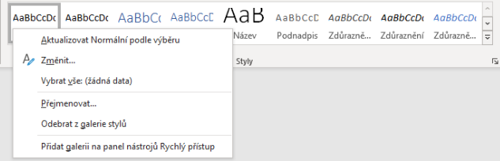
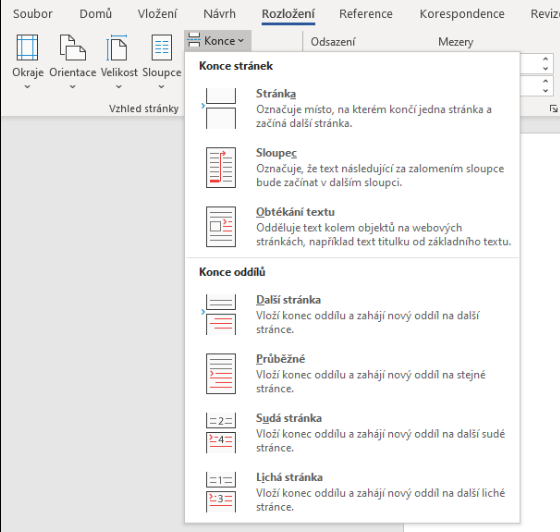

# Word
* Textový procesor od firmy Microsoft 
* Slouží k vytváření formátovaného textu
* Lze formátovat dokument (nastavení fontu, velikosti písmen, barva textu atd.)
* Kompatibilní s operačnímy systémy Windows a MacOS
* Současná verze **2019**

## Popis prostředí
### Pruh aplikace
- Vlevo panel nástrojů **Rychlý přístup**
- Uprostřed - název dokumentu a aplikce 
- Vpravo uživatel, přepínač skrývání karet
# Karty
- Soubor, Domů, Vložení, Kreslení, Návrh, Rozložení, Reference, Korespondence, Revize, Zobrazení, Vývojář, Nápověda
# Pracovní polocha
- Dokument, pravítka
# Stavový řádek
- Počet stránek, počet slov, jazyk

## Styly
* Vzhled textu a stránky
* Existuje několik předdefinovaných stylů, které slouží pro nejčastější „druhy“ textů (nadpisy, záhlaví a zápatí, běžný text apod.)
* Lze v nich **nastavovat veškeré formátování textu** (Font, velikost, barva, mezery odstavů, zarovnání, atd.)

  Nastavení stylů v Office Word
  :-:
  </img>
  Nabídku stylů lze najít v kartě **Domů**
  
## Formát
- Několik stylů dohromady

## Šablony
* Připravené dokumenty s definovaným vzhledem a styly jednotlivých částí
* Lze vytvořit svojí vlastní (nastavíme formátování a uložit jako šablona)

## Oddíly
* Slouží k vytvoření různorodého rozvržení v rámci jedné nebo více stránek
* Konce oddílů
   * **Další stránka**: vložení konce oddílu, nový oddíl začne na další stránce.
   * **Stejná stránka**: vložení konce oddílu, nový oddíl začne na téže stránce.
   * **Lichá stránka** nebo **Sudá stránka**: vložení konce oddílu, nový oddíl začne na následující liché nebo sudé stránce (podle číslování stránek)
   * Sloupec text se bude řadit jako novinové články (další sloupec vždy po zalomení sloupce)
* Můžete změnit následující prvky formátování oddílů:
   * Okraje, formát nebo orientace papíru, zdroj papíru pro tiskárnu, ohraničení stránky, svislé zarovnání, záhlaví a zápatí, sloupce, čísla stránek, čísla řádků, poznámky pod čarou a vysvětlivky.  
  
  Nastavení konců v Office Word
  :-:
  </img>
  Nabídku **Konce** lze najít v kartě **Rozložení** (v nabídce **Vzhled stránky**)

## Obsah
1. Lze vytvořit pomocí použití stylů nadpisů (například Nadpis 1, Nadpis 2 a Nadpis 3) u textu, který chcete do obsahu zahrnout.
1. Aplikace Microsoft Word vyhledá příslušné nadpisy a potom vloží obsah do dokumentu. 
1. Pokud obsah vytvoříte tímto způsobem, můžete jej při provádění změn v dokumentu automaticky aktualizovat.

## Záhlaví a zápatí
* Umístěné na horním, dolním a bočním okraji každé stránky v dokumentu.
* Můžete například přidat čísla stránek, datum a čas, logo společnosti, název dokumentu, název souboru nebo jméno autora.

## Strukturovaný dokument
* Nadpisy, odrážky, obsah, font

## Typografie
* Obor, který se zabývá tiskovým písmem

### Typografická chyba (U maturity !!!!)
* Více mezer nebo odřádkování za sebou
* Na konci odstavce odřádkovat pouze jednou
  * Mezera za odstevcem se nastavuje pomocí stylů
* Nakonci řádku nesmí být samohláska **(Parchant)** nebo rozděleny důležité texty (Použít pevnou mezeru ctrl+shift+mezerník)
* Opakování slov na konci a na začátku
* Rozdělení odstavce na více stránek
* Fotka musí být svázána s textem (nesmí být na samostatné stránce) a musí mít popisek

## Úprava dokumentu

1. Nastavit okraje a odsazení
1. Nadefinovaný styly pro nadpis a text
1. Nastavit oddíly a číslování stránek (v zápatí například)
   - pro nastavení číslování od x stránky se musí použít oddíly a v oddílu 2 zrušit propojit s předchozím
1. Nastavit orientaci (pokud chceme)
1. Přidat obsah
1. Přidat popisek k tabulkám a obrázkům
1. vložit reference a citace

## Hromadná korespondence
* Umožňuje vytvořit několik dokumentů se shodným textovým i grafickým formátováním a obsahem, ale s určitými rozdílnými částmi (například osobními údaji)
* Jako zdroj bere databázi či tabulku s daty a záznamy zní doplňuje na příslušná místa v dokumentu
