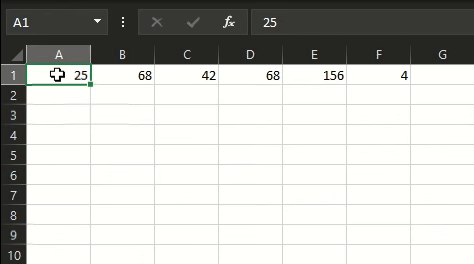
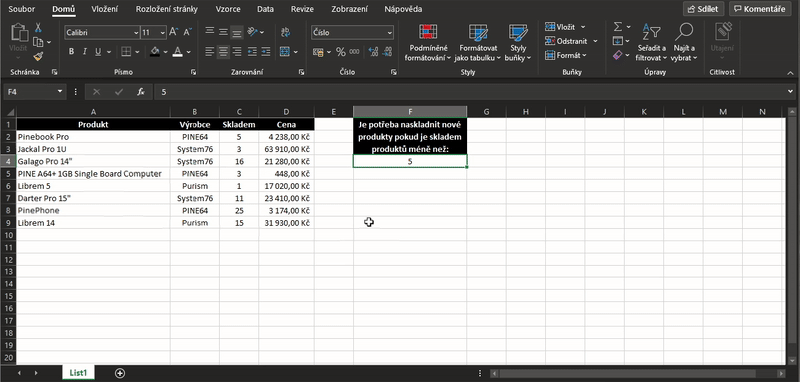

# Excel
- Proprietární **tabulkový procesor** od firmy Microsoft
- Slouží k práci s tabulkami, funkcemi a grafy
- Umožňuje třídit a filtrovat data
- Kompatibilní s operačnímy systémy Windows, MacOS, iOS, Android
- Excel je také dostupný ve webové verzi
- Současná verze **2019**

## Sešit
* Celý dokument v excelu
* Obsahuje menší část (**list**)

## Oblast
* Výběr několika buněk
* Dají se formátovat a pracuje se s nimi ve funkcích
  - Oblast se dá nějak pojmenovat a zavolat pod určitým jménem
* Používá dvojtečku
* Např. `B1:D3`

### Absolutní odkazování
* Umožní aby se hodnota určité buňky dynamicky neměnila při kopírování
* Například: `$B1`, `$B$1:$D$3`
  Příklad užití absolutního odkazování
  :-:
  </img>

## Styly
### Podmíněné formátování
* Při splnění podmínky se nějak naformátuje vybraná část
  Příklad užití podmíněného formátování
  :-:
  </img>

# Grafy
* Vizualní zobrazení dat
* Druhy (linearni, kolacovy, bodovy, panelakovy)

# Buňka
* Obsahuje hodnotu nebo funkci
* Dá se formátovat

## Řada
* Automaticky doplňuje hodnoty (1 a 2 bunka = 1;2 a pak automaticky se doplni hodnoty)

## Formátování
* Dá se v buňce naformátovat typ hodnoty (např. měna, datum)
* Zalomit text a zarovnat text změnit velikost písma, font, barvu, 
* Dají se sloučit

# Seřazení
* Oblast buněk se dá řadit podle abecedy anebo podle velikosti hodnot

# Kontigenční tabulka
* Slouží k filtrování velkého množství dat

# Funkce 
* Pracují s daty
* Začíná znakem **=**
* Mohou být normální nebo vnořené [více funkcí v sobě např. =ZPRAVA(B1;DELKA(B1))]

## Důležité funkce které zmínit
* Index (Vrátí hodnotu nebo odkaz na buňku v určitém řádku a sloupic v dané oblasti) 
* Když (Podmínka), dnes (dnešní datum), suma (součet čísel), prumer (průměr čísel)

Více informací: [Excel funkce a vzorce - tahák](Dal%c5%a1%c3%ad%20materi%c3%a1ly/excel-funkce-vzorce-tahak.pdf)
