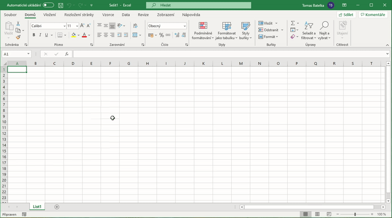

Podrobnosti lze najít [zde](https://github.com/Vofy/Maturita/blob/main/Informa%C4%8Dn%C3%AD%20a%20komunika%C4%8Dn%C3%AD%20technologie/Dal%C5%A1%C3%AD%20materi%C3%A1ly/06_Makra_uvod.pdf).

# Makro
* Posloupnost příkazů, činností nebo stisknutých kláves, které je možné vyvolat zadáním jediného povelu
* V Excelu se dají makra **zaznamenat** nebo **naprogramovat**
* V Excelu programovány v jazyce **VBA**
    * **Objektově orientovaný programovací jazyk**, který je součásti MS Office
    * VBA Dokáže:
        1. zautomatizovat opakující se činnosti (zrychlení práce a předejde se možným chybám)
        1. připravit data pro převod mezi aplikacemi (např. z Excelu do relační databáze)
        1. vytvořit vlastní funkce
        1. pomocí formulářů vytvořit celé aplikace

### Přidání karty vývojář
1. Abyste mohli pracovat s makry, musíte mít v Excelu aktivní kartu **Vývojář** (není povolená defaultně)
1. Pro její zobrazení jděte (v Excelu 2019) na **Soubor** -> **Možnosti** -> **Přizpůsobit pás karet** a zaškrtněte "Vývojář".
   Přidání karty vývojář
   :-:
   </img>

### Záznam makra
1. V kartě **Vývojář** klikneme na "Zaznamenat makro"
1. Můžeme dát makru i nějaké jméno, ale bez mezer
1. Pak provedeme to co chceme, tedy uděláme obsah makra, např. Klikneme na nějaké buňky a dáme delete
1. Poté klikneme na "Zastavit makro“, tímto je makro vytvořené

## Programování makra
1. V kartě "Vývojář" nalezneme tlačítko "Visual Basic" neboli VBA a na to klikneme. 
1. Při programování maker je důležité si zvolit krátké a výstižné proměnné bez diakritiky, tak aby bylo jasné o jaký parametr jde. 
1. Krom proměnné je potřeba také deklarovat platnost:
    1. **Static** - Statická proměnná dokud pro danou proceduru, zachovává si platnost.
    1. **Public** - Ve všech modulech a procedurách zachovává si platnost i po skončení dané procedury.
    1. **Private** - Dostupné pro všechny procedury v daném modulu.
    1. **Dim** - Dostupné pro jednu proceduru v daném modulu. Jen když tento modul běží. Nebo pro procedury v daném modulu. Záleží kde je deklarace uvedena.
* Každé makro začíná Sub a End Sub. Existují také **Funkce** a **Procedury**. Rozdíl mezi funkcí a procedurou je to, že **funkce vrací výsledek**, procedura žádný výsledek nevrací. 

## Příklad
```VB
//PROCEDURA Nastaví na danné buňce kurzívu a tlusté písmo 
// Tohle Makro bylo zaznamenáno takže k němu je ještě přiřazená klávesová zkratka
Sub Makro1()
    Selection.Font.Bold = True
    Selection.Font.Italic = True
End Sub

//FUNKCE vrací součet dvou čísel 
// Volá se =<NÁZEVFUNKCE>(<PARAMETR1>;<PARAMETR2>;...)
Function SOUCETFUNKCE(Cislo1 As Integer, Cislo2 As Integer) As Integer
    soucetFunkce = Cislo1 + Cislo2
End Function
```
