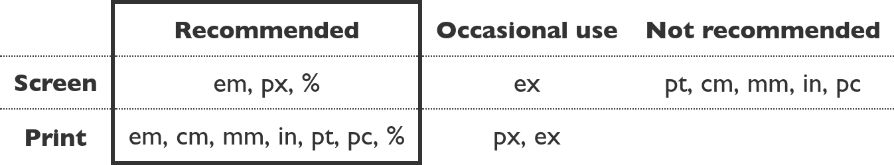

# Počítačová grafika
* Obor výpočetní techniky, který využívá počítače k tvorbě umělých grafických objektů
* Zabývá se tvorbou a úpravou grafických informací
* Barvy jsou v počítačové grafice tvořeny kombinací několika základních barev a faktorů, tyto kombinace se nazývají barevné modely
* Počítačovou grafiku můžeme dělit jako statickou a dynamickou (video)
* Můžeme ji také dělit podle počtu rozměrů se kterými pracujeme (2D a 3D)
  * Stereoskopie
    * Technologie, která umožňuje prostorový zrakový vjem

## Hustota obrazových bodů (pixelů)
- **DPI** - počet obrazových bodů na palec

## Rozlišení
- **Počet pixelů**, který je schopno určité zařízení snímat, zobrazit nebo reprodukovat
- **Rozlišení obrázku** - počet pixelů, ze kterých je obrázek tvořen

## Poměr stran
- Každé snímací, zobrazujíci nebo reprodukujcí zařízení či obrázek má určitý **poměr stran (nejčastěji to bývají: `16:9`, `4:3`, `21:9`)**

## Jednotky
Doporučené jednotky pro využití v tisku nebo zobrazení na obrazovce (W3C)
:-:
</img>

- Vztah mezi absolutními jednotkami
  ```
  1in (palec) = 2.54cm = 96px (pixely) = 72pt (body) = 6pc (picas - jednotka užívaná v typografii)
  ```

## Světlo
- Světlo můžeme brát jak elektromagnetické vlnění nebo jako proud částic (fotonů)

### Barva
- Vlnová délka světla ve viditelném spektru (viditelná část elektromagnetického spektra je 390 - 760 nm)
- Každý obrázek má **barevnou hloubku**

#### Barevná hloubka
- Popisuje **počet bitů** použitých k popisu určité barvy

Počet bitů | Počet barev                                | Další označení
:--------: | :----------------------------------------- |:-----------------:
1          | 2<sup>1</sup> (2 barvy)                    |  Mono Color
4          | 2<sup>4</sup> (16 barev)                   |  -
8          | 2<sup>8</sup> (256 barev)                  |  -
15         | 2<sup>15</sup> (32 768 barev)              |  Low Color
16         | 2<sup>16</sup> (65 536 barev)              |  High Color
24         | 2<sup>24</sup> (16 777 216 barev)          |  True Color
32         | 2<sup>32</sup> (4 294 967 296 barev)       |  Super True Color
48         | 2<sup>48</sup> (281 474 976 710 656 barev) |  Deep Color

#### Barevný prostor
- Je předem definovaná množina barev, kterou je schopno určité zařízení snímat, zobrazit nebo reprodukovat.

#### Gammut
- Dosažitelná oblast barev v určitém barevném prostoru
- Barvy mimo tuto oblast lze v daném barevném prostoru zobrazit jen přibližně

## BAREVNÉ MODELY
### 1. RGB
- **R**ed, **G**reen, **B**lue
- Základní barvy jsou **červená, zelená a modrá**
- Barvy se při míchání **sčítají**
- **Výsledná barva je bílá** (to je důsledkem zvyšování intenzity při sčítání barev)
- Jednotlivé pixely jsou složené z červených, zelených a modrých obdelníčků
- **Model se využívá pro reprezentaci barvy na zařízeních, které snímají světlo** (fotoaparát, skener) **nebo jej sami vyzařují** (monitor, projektor, ...)
- V počítačové grafice (css, ...) se nejčastěji využívá `24-bitová paleta` (truecolor), kde se jednotlivé barevné složky vyjadřují v desítkové soustavě jako čísla od `0` do `255` – např. `rgb(0,255,255)`
  - U tohoto barevného modelu můžeme použít ještě jednu složku a to tzv. **alfa kanál**, který udává hodnotu průhlednosti pixelu

### 2. CMYK
- **C**yan, **M**agenta, **Y**ellow, **K**ey
- Základní barvy jsou **tyrkysová, purpurová, žlutá a černá**
- Barvy se při mýchání **odčítají**
- **Výsledkem smýchání barev je černá** (ale není to dokonalá černá – při tisku se využívá černá zvlášť)
- **Model se využívá zejména při tisku**

Existují i další modely například **HSV** nebo **HSL** ty se zaměřují na odstín, sytost a hodnotu (jas). Tyto modely jsou nejbližší našemu vnímání barev

### Míchání barev
Aditivní míchání barev (RGB) | Subtraktivní míchání barev (CMYK)
:---------------------------:|:--------------------------------:
</img> | </img>

## Reprezentace obrazových informací

### 1. Vektorová grafika
- Vektorová grafika využívá křivek a bodl k zachycení obrazových informací, takový vektorový obrázek je složený ze zakladních geometrických útvarů (body, přímky, křivky, mnohoúhelníky)
- Vektorový obrázek můžeme libovolně zvětšovat či zmenšovat, aniž by utrpěla jeho kvalita

### 2. Rastrová grafika
- Rastrová grafika využívá k prezentaci obrazku jednotlivé pixely, tyto pixely jsou zaneseny do **mřížky–rastru**
- Při zvětšení se viditelně zhorší kvalita obrázku

Vektorová a rastrová grafika
:-
</img>

## Formáty
### Vektorové grafiky
- .pdf
- .adp
- .cdr
- .svg

### Rastrové grafiky
- .jpeg – ztrátová komprese
- .gif – bezeztrátová komprese
- .png – bezeztrátová komprese
- .raw – bez komprese

## Reference
* [SVG Explained in 100 Seconds](https://youtu.be/emFMHH2Bfvo) (ENG)
