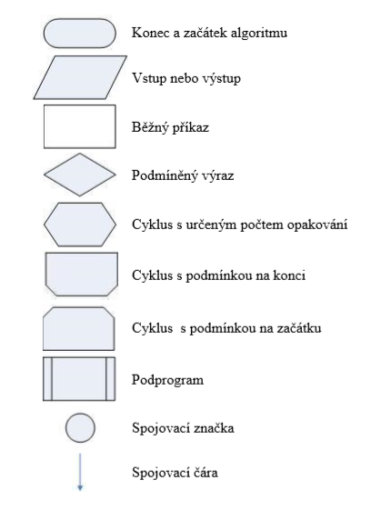
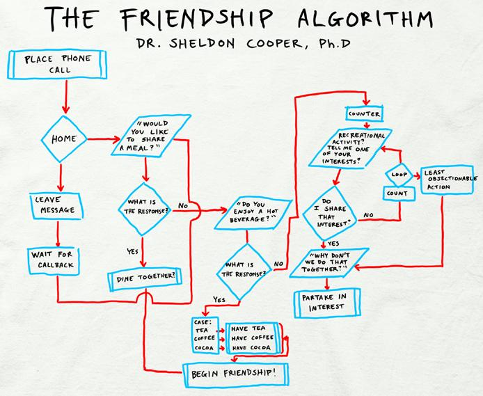

## Algoritmus
* Přesný návod či postup, kterým lze vyřešit daný typ úlohy.  
* Měl by být co nejednoduší 
* Pojem algoritmu se nejčastěji objevuje při programování, kdy se jím myslí teoretický princip řešení problému 
* Obecně se ale algoritmus může objevit v jakémkoli jiném vědeckém odvětví. Jako jistý druh algoritmu se může chápat i např. kuchařský recept. Zpravidla však na algoritmy klademe určitá omezení. 

## Vlastnosti 
1. **Jednoduchost (elementárnost)**
	* Skládá se z konečného počtu jednoduchých kroků 
1. **Konečnost (rezultativnost)**
	* Každý algoritmus musí skončit v konečném počtu kroků. 
	* Počet kroků může být libovolně velký, ale musí být vždy konečný 
	* Postupy, které tuto podmínku nesplňují se mohou nazývat výpočetní metody (např. reaktivní proces, který průběžně reaguje s okolním prostředím) 
1. **Obecnost**
	* algoritmus řeší všechny úlohy daného typu 
	* má širokou množinu možných vstupů 
1. **Určitost (determinovanost)**
	* Každý krok algoritmu musí být jednoznačně a přesně definován 
	* V každé situaci musí být naprosto zřejmé, co a jak se má provést, jak má provádění algoritmu pokračovat.  
1. **Korektnost**
	* algoritmus skončí pro libovolná (korektní) data správným výsledkem v konečném množství kroků. 
1. **Výstup**
	* Algoritmus má alespoň jeden výstup, veličinu, která je v požadovaném vztahu k zadaným vstupům, a tím tvoří odpověď na problém, který algoritmus řeší 

## Metody návrhu 
* **Shora dolů** – postup řešení rozkládáme na jednodušší operace 
* **Zdola nahoru** – z elementárních kroků vytváříme prostředky, které nakonec umožní zvládnout požadovaný problém. 
* **Kombinace obou** – obvyklý postup shora dolů doplníme "částečným krokem" zdola nahoru tím, že se například použijí knihovny funkcí, vyšší programovací jazyk nebo systém pro vytváření programů. 

## Dělení algoritmů 
### Iterativní a rekurzivní algoritmy
1. Iterativní algoritmy
	* Iterativní algoritmus je takový, který spočívá v opakování určité své části (bloku). 
1. Rekurzivní algoritmy
	* Rekurzivní algoritmus naproti tomu opakuje kód prostřednictvím volání sebe sama
	* Každý rekurzivní algoritmus lze převést do iterativní podoby.
	* Výhoda rekurzivních algoritmů je v jejich snadno čitelném a kompaktním zápisu. Nevýhodou je spotřeba dodatečných systémových prostředků pro udržení jednotlivých rekurzivních volání. 

### Deterministické a nedeterministické algoritmy 
* Deterministický algoritmus – Algoritmus, který má v každém svém kroku právě jednu možnost, jak pokračovat. Nedeterministický jich má více.

### Sériové, paralelní a distribuované algoritmy 
* **Sériový** algoritmus vykonává všechny kroky **v sérii** (jeden po druhém) 
* **Paralelní** algoritmus tyto kroky vykonává **zároveň** (ve více vláknech)  
* **Distribuovaný** algoritmus kroky vykovává **zároveň na více strojích**

### Asymptotická složitost algoritmu 
* Charakterizuje počet provedených operací v závislosti na velikosti dat

## Způsoby zapsání algoritmu
1. **Písemně**
	* Postup se napíše slovně na kus papíru

1. **Vývojovým diagramem**
	* Grafické znázornění jednotlivých kroků, pracovního postupu nebo nějakého procesu 
	  
	  Symboly užívané při tvorbě vývojového diagramu
	  :-:
	  </img>
	  
	  Algoritmus přátelství
	  :-:
	  </img>
	  Diagram využívá nestandardní značku konce a začátku algoritmu
1. **Strukturogramem**
	* https://encyklopediapoznania.sk/clanok/2578/strukturogram

1. **UML diagramem**
	* https://cs.wikipedia.org/wiki/Unified_Modeling_Language

1. **Programovacím jazykem**
	* Zápis algoritmů, jež mohou být provedeny na počítači 
	* Nazývá se program 
