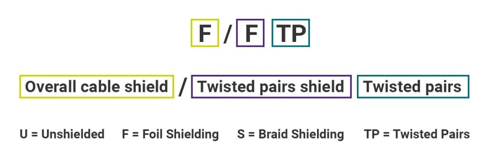

# Aktivní
- Pracují se signálem (a zesilují ho)

## Fyzická vrstva
1. **Síťová karta** 
    - Připravuje signál pro přenos

1. **Hub (Rozbočovač)**
    - Přeposílá data všem 
    - Všechny porty, upravuje a zesiluje signál

1. **Zesilovač**
    - Opravuje a zesiluje signál

1. **Převodník**
    - Převádí jeden typ média na jiný a zároveň funguje jako zesilovač
	- **Access point** (AP, přístupový bod)
		- Umožňuje zařízením připojit se do sítě pomocí wifi (2.4GHz, 5GHz)

## Linková vrstva

1. **Switch [Přepínač]**
	- Narozdíl od hubu posílá data pouze příslušnému zařízení
	- Při prvním zapnutí se naplní MAC tabulka
	- Způsoby přeposílání rámců
		1. **Store and foward** (Kontrola a pak posíla) 
    		- Rámec z jednoho rozhraní přijmou, uloží si do vyrovnávací paměti, prozkoumají jeho hlavičky, zkontroluji FCS a následně odvysílají do příslušného rozhraní.
		1. **Cut-through switching** (Hned posíla)
    		- K analýze hlaviček dochází, jakmile dorazí začátek rámce. Ani s vysíláním do cílového rozhraní se nečeká, až dorazí celý rámec, ale zahajuje se co nejrychleji, aby zpoždění rámce v přepínači bylo minimální.

1. Bridge

## Síťová vrstva
1. **Router**
    - Směruje mezi sítěmi
    - Má routovácí tabulku do kterém je routovací protokol, subnet id
    - Vyhodnotí nejvýhodnější cestu dle metriky routovacího protokolu (RIP - hops, OSPF - cost) 
    
# Pasivní
- nese signál (Kabely)

## Koaxiální kabel
- Skládá se z vnějšího obalu, síťky, vnitřního obalu, živý vodič
- Maximální rychlost přenosu dat 10Mb/s
- Terminátor 50 ohm

### Tlustý ethernet (10BASE5)
- Maximální délka 500m

### Tenký ethernet (10BASE2)
- Maximální délka 200m

### Další používané standardy
- RG-6, RG-59, ...

## Krocená dvoulinka

### 4 páry (ethernet)
- Konektory: RJ-45, RJ-45 keystone

Stínění kroucené dvojlinky
:---:
</img>

Stínění kroucené dvojlinky
:---:
</img>

### 2 páry (telefon)
* Konektor: RJ-11

## Optický kabel
* Rozdělení: **Jednovidový** (jeden kabel) a vícevidový (více kabelů)
* Signál se v kabelu odráží v podobě paprsku
* Konektor LC, SC, ST
