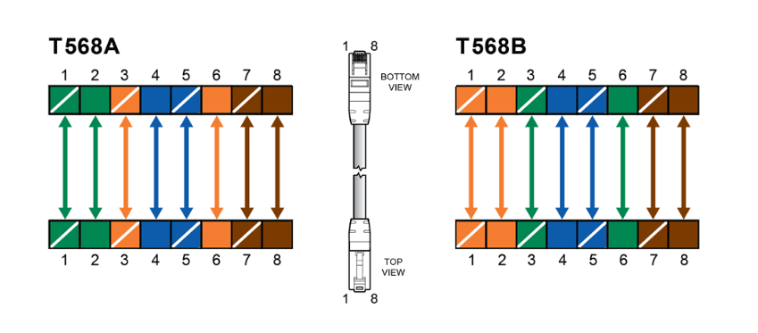
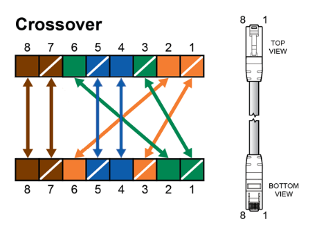
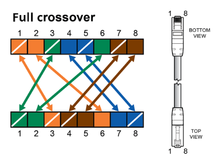

# Fyzická vrstva

## Zapojení konektorů
T568A a T568B
:---:

### Crossover
Crossover (10/100Mbs) | Full crossover (10/100/1000Mbs)
:---: | :---:
 | 

### Keystone
Keystone
:---:

Zapojení keystonu bývá různé, proto je na něm bývá namalované schéma
