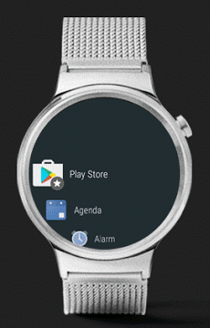
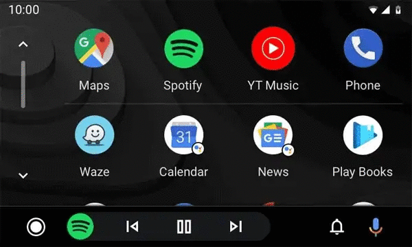

# Android
* Android je nejrozšířenější **operační systém pro mobilní zařízení** na světě. Používá se v chytrých telefonech, tabletech, hodinkách, ale i v náramcích a autech. Systém Android je postavený na **linuxovém jádře** a je **open source**.
* Android je dostupný na platformách `ARM`, `ARMv8`, `x86`, `x86-64`, `MIPS`, `MIPS64`
* Android současně vyvíjí **Google** a **Open Handset Alliance**

## Užítí Androidu
* `Android` – Mobilní zařízení, tablety, *počítače (distribuce Remix OS, Android-x86, Phoenix OS)*
* `Wear OS` (dříve `Android Wear`) – Chytré hodinky
* `Android TV` – Operační systém pro chytré televize
* `Android Auto` – Operační systém pro osobní automobily

| Android | Wear OS | Android TV | Android Auto |
| :-----: | :-----: | :--------: | :----------: |
| </img> | </img> | </img> | </img> |

## Historie
* V říjnu 2003 **Andy Rubin**, Rich Miner, Nick Sears, and Chris White **založily v Kalifornii společnost Android Inc.**
* Google Inc. v srpnu roku 2005 odkoupil v té době tuto nepříliš známou startup společnost
	* Po odkoupení společnosti tým Googlu pod vedením Andyho Rubina vyvinul platformu založenou na Linuxovém jádře
* V září roku 2007 Google získal několik patentů v oblasti mobilních technologií.
* 5.&nbsp;listopadu 2007 bylo vytvořeno uskupení Open Handset Alliance
	* Konsorcium, které zahrnovalo společnosti zabývající se výrobou mobilních telefonů, čipů nebo mobilních aplikací, např. Google, HTC, Intel, LG, Motorola, nVidia, Qualcomm, Samsung, Texas Instruments a dalších 25 společností
* V říjnu roku 2008 byl představen první komerční mobilní telefon T-Mobile G1 (HTC Dream) s OS Anroid

## Architektura

Architektura platformy android
:-:
</img>

### Jádro operačního systému
* Jádrem systému je modifikovaný Linux
* Důvodem použití byla vlastnost poměrně snadného sestavení na různých zařízeních a tím zaručená přenositelnost.
* Využito mnoha funkcí Linuxu (podpora správy paměti, správa sítí, zabudované ovladače nebo správy procesů [Přispívá ke stabilitě a také ochraně systému.])

</img>

### Hardware Abstraction layer
* **Vrstva abstrahující hardware**
* HAL vytváří rozhraní pro komunikaci vyšších vrstev systému s hardwarem
* Hardware Abstraction Layer poskytuje standardní rozhraní, které vystavují schopnosti hardwaru zařízení do vyšší úrovně rozhraní Java API
* Modul Hardware Abstraction Layer se skládá z několika knihovních modulů, z nichž každý implementuje rozhraní pro konkrétní typ hardwarových komponent (např. kamera nebo modul bluetooth)
* Když rozhraní API Framework vyvolá přístup k hardwaru zařízení, systém Android načte knihovní modul pro tuto hardwarovou komponentu

### C/C++ Libraries
* Nad jádrem je situovaná vrstva knihoven, které poskytují přímý přístup aplikací k různým komponentám systému Android
* Jsou to nativní knihovny napsané v C/C++
* Tvoří mezivrstvu mezi různými komponentami vyšších vrstev a linuxovým jádrem.
* Příklad knihoven: `Modul Surface Manager` (multidotikový displej, kompozice grafického výstupu), `Webkit`, `LibC`

### Android Runtime
* Android Runtime obsahuje **sadu základných knihoven**
* Každá aplikace pro Android je samostatný proces využívající vlastní instanci virtuálního stroje DVM (Dalvik Virtual Machine)
	* Dalvik Virtual Machine na mobilních zařízeních je analogií Java Virtual Machine na klasických počítačíchTento zabezpečuje běh spustitelných souborů s příponou DEX.
		* Soubory DEX vznikly kompilací z klasických souborů CLASS a JAR. Jsou kompaktnější než klasické soubory CLASS.
	* Dalvik je optimalizovaný pro mobilní zařízení, to znamená, že bere v úvahu omezení možnosti napájení, menší paměť a podobně
	* Současně může běžet více instancí virtuálního stroje.

### Application framework (Java API Framework)
* Aplikační framework obsahuje v aplikacích opakovaně použitelný software, například ovládací prvky, ikony a podobně
* Framework je napsán v Javě a je to nejdůležitější vrstva pro vývojáře aplikací
* Poskytuje aplikacím základní služby systému

#### Package Manager
* Modul správce balíčků je v podstatě databáze, která udržuje aktuální seznam všech aplikací nainstalovaných v zařízení

#### Window Manager
* Spravuje okna, která tvoří aplikace
* Androidí aplikace využívají většinou dvě a více oken současně
	* Například pokud si spustíte navenek jednoduchou aplikaci webového prohlížeče, se stává ze dvou oken
		* V horní části je oznamovací lišta zobrazující různé ukazatele, například sílu signálu GSM či Wi-Fi, stav baterie, čas... (o tuto lištu se vývojář aplikace nestará)
		* Webová stránka je zobrazena v hlavním okně aplikace.

#### View System
* Spravuje širokou paletu společných prvků grafického uživatelského rozhraní, jako jsou ikony, tlačítka, prvky na zobrazení a editování textu a mnohé další.

#### Resource Manager
* Poskytuje přístup k prostředkům jako `strings`, `graphics`, `layout` (soubory ve složce resources)

#### Activity Manager
* Spravuje životní cyklus aplikace a poskytuje společný "back stack" (zásobník navštívených destinací - např. aktivity)

#### Notification Manager
* Umožňuje aplikacím zobrazovat oznámení

#### Content Providers
* Umožňuje aplikacím přístup k datům jiných aplikací (např. k aplikaci Kontakty) nebo sdílet svá vlastní data,

#### Location Manager

### Aplikace
* Aplikace se skládá ze čtyř typů komponent: `Activity` (aktivity), `Services` (služby), `Broadcast Receivers`, `Content providers` (poskytovatelé obsahu)

#### Activity
* Aktivita je hlavní třída, která se uživateli zobrazí po spuštění aplikace
* Aplikace může sestávat z více aktivit, které si vzájemně odevzdávají údaje
* Aktivity umožňují uživatelům přes grafi cké rozhraní (GUI) přijímat informace od aplikace a ovládat ji
* Přes aktivitu se zpravidla implementuje více nebo méně komplexní částečná úloha, kterou má uživatel realizovat, například vyplnit formulář, nastavit parametry, vybrat si položku ze seznamu a podobně
* Třída Activity je předurčena k tomu, aby zobrazovala uživatelské rozhraní a zachytávala interakce uživatele přes toto rozhraní. 

##### Životní cyklus aktivity

</img>

#### Services
* Služby realizují déle trvající operace a **operace na pozadí**
* Také umožňují spolupráci se vzdálenými procesy
* Na rozdíl od aktivit běží služby na pozadí a nepotřebují uživatelské rozhraní
* Služby umožňují asynchronně, paralelně s hlavním vláknem, provádět operace, jejichž rea-lizace trvá déle
* Také umožňují požádat různé procesy o provedení operace a sdílení údajů
* Typickým příkladem služby je přehrávání hudby na pozadí

#### Broadcast Receivers
* Objekty na vysílání a přijímání poslouchají na pozadí a reagují na události, které se odehrávají na zařízení
* Broadcast Receivers fungují na principu publish/subscribe. Události jsou zastou-peny objekty typu Intent (záměr)
* Vydavatelé vytvářejí záměry a následně je přes Broadcast směrují do vysílání
* Zachytávají je přijímače, které mají příslušné záměry objednané nebo registrované
* Dobrým příkladem na ilustraci fungování Broadcast Receivers je přijetí SMS zprávy nebo e-mailu
	* V okamžiku, kdy zpráva přijde do telefonu, Android tuto skutečnost uživateli vhod-ně oznámí. 

#### Poskytovatelé obsahu (Content providers)
* Poskytovatelé obsahu umožňují ukládání a sdílení dat mezi více aplikacemi a procesy
* Aplikace tak mohou přistupovat k údajům ostatních aplikací, které vystupují jako poskytovatelé obsahu
* Využívá se rozhraní podobné databázovému, poskytovatelé obsahu jsou ale více než jen databáze.

### Souborový systém

#### Oddíly
- `boot` – Slouží k zavedení systému, obsahuje obrazy jádra systému a ramdisk
- `system` – Obsahuje Android framework
- `odm` (Original Design Manufacturer) – Obsahuje přizpůsobení pro systémy na čipu (SoC), umožňuje například implementaci kernel modulů pro specifické komponenty, démony a specifické funkce na úrovni HAL
- `recovery` – Tento oddíl slouží jako image pro obnouvu, která je nabootovaná při OTA (over-the-air) procesech (např. OTA update - instalace aktualizací systému)
- `cache` – Slouží jako uložiště pro dočasná data a na některých zařízeních nemusí být přítomná pokud zařízení používá "seamless updates"
- `misc` – Oddíl používaný oddílem `recovery`
- `userdata` – Obsahuje uživatelem instalované aplikace a data včetně přizpusobení
- `metadata` – Používá se tehdy, když je zařízení zašifrované
- `vendor` – Obsahuje binární soubory, které nejsou distribuovatelné přes AOSP (Android Open Source Project). Pokud zařízení neobsahuje žádné proprietární informace, může být vynechána
- `radio` – Obsahuje image "radio", která se používá pouze na zařízeních, která používají pro rádiový přenos specifický software na dedikovaném oddílu
- `tos` – Tento oddíl obsahuje binární obrazy Trusty OS a je používána pouze na zařízeních, které [Trusty](https://source.android.com/devices/bootloader/partitions/tos-partitions) obsahují

## Bezpečnost
* Operační systém byl navržen s vícevrstvou bezpečností, která poskytuje fl exibilitu vyžadovanou pro otevřené platformy. Android převzal některé základní mechanizmy zabezpečení z Linuxu.
* Důležitým bezpečnostním mechanizmem je takzvaný Sandbox pro izolovaný běh aplikací. Každá aplikace (APK) je spouštěna s vlastním přiděleným UID v separátním procesu. Aplika-ce dostanou přidělenou část ze souborového systému, kam mohou zapisovat soukromá data
* Od verze 3.0 podporuje Android šifrování souborového systému, takže všechna uživatelská data mohou být šifrována v jádře použitím dmcrypt implementace AES-128 s CBS a ESSI-V:SHA256. Šifrovací klíč je chráněn AES-128 použitím klíče odvozeného od uživatelského hesla, což zaručuje ochranu před neautorizovaným přístupem.
